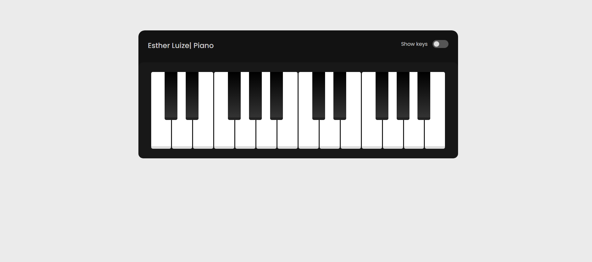

<h1 align="center"> 🎹 Piano 🎹</h1>

## Sobre o Projeto 🚀
Projeto criado para simular um teclado instrumental. Comn intuito de ao clicar reproduzir o som das teclas pelo navegador. Além disso, foi colocado um checkbox para mostrar quais teclas devem ser clicadas.

#

## Tecnologia 💻
-  - HTML

-  - CSS

-  - JS

#
## Considerações 🚧

- Para visualizar o site acesse o link: https://piano-estherluize.netlify.app
 
- Dê uma ⭐ se você gostou deste site!
